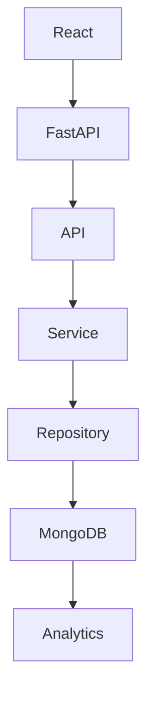

# Quiz Analytics Platform


Core philosophy:

> Store facts. Compute insights.

A production-inspired Quiz Analytics Platform built to explore scalable backend architecture, event-driven learning analytics, and modern software engineering practices using React, FastAPI, and MongoDB.

---

## Table of Contents

- Vision
- Tech Stack
- Project Structure
- Features
- Architecture
- Roadmap
- Engineering Decisions
- Design Goal


## Vision

Rather than storing only quiz scores, this platform captures every quiz interaction as immutable events and derives meaningful learning insights using MongoDB aggregation pipelines.

---

## Getting Started

### Backend

```bash
cd backend

python -m venv venv

venv\Scripts\activate

pip install -r requirements.txt

uvicorn main:app --reload

---

## Tech Stack

| Layer           | Technology        |
| --------------- | ----------------- |
| Frontend        | React + Vite      |
| Backend         | FastAPI + Python  |
| Database        | MongoDB Atlas     |
| Documentation   | OpenAPI + Swagger |
| Version Control | Git + GitHub      |

Architecture

- Repository Pattern
- Service Layer
- Layered Architecture


---


## Project Structure

```text
quiz-analytics-platform/

├── backend/
│   ├── app/
│   │   ├── api/
│   │   ├── services/
│   │   ├── repositories/
│   │   ├── analytics/
│   │   ├── database/
│   │   └── config/
│
├── frontend/
│
├── docs/
│
├── seed/
│
└── diagrams/
```
---

## Why this project?

Most quiz applications store only the final score.

This platform captures every meaningful learning event, allowing richer analytics such as response time, learning velocity, fatigue detection, and topic mastery.

---

## Features

✅ Layered Backend Architecture

✅ FastAPI REST APIs

✅ MongoDB Atlas Integration

✅ Event-driven Quiz Tracking

✅ Swagger Documentation

🚧 Learning Velocity Analytics

🚧 Fatigue Detection

🚧 Adaptive Recommendations

---

## Engineering Progress

- [x] Repository Initialized
- [x] Project Architecture Designed
- [x] FastAPI Configured
- [x] Swagger Documentation
- [x] APIRouter Setup
- [x] MongoDB Connection
- [x] Repository Layer
- [x] Service Layer
- [ ] Quiz Engine
- [ ] Analytics Engine
- [ ] React Integration
- [ ] Deployment

---

## Architecture Philosophy

This project follows a layered architecture.



Every layer owns exactly one responsibility.

---

## Design Principles

- Single Responsibility Principle
- Separation of Concerns
- Repository Pattern
- Service Layer Pattern
- Event-driven Analytics
- Configuration Management
- Clean Project Structure

---

## Status

🚧 Currently under active development.


## Roadmap

- ✅ Foundation

- 🚧 Data Layer

- ⏳ Quiz Engine

- ⏳ Analytics Engine

- ⏳ Dashboard

- ⏳ Deployment

## Future Improvements

- Adaptive quizzes
- AI-generated question recommendations
- Learning Velocity Index
- Fatigue Detection
- Instructor Dashboard
- Team Analytics

## Project Philosophy

The platform stores quiz events rather than only quiz scores.

By preserving every interaction, analytics can evolve without changing historical data.

## Current Vertical Slice

The project has reached its first complete vertical slice:

Current Vertical Slice

FastAPI

↓

MongoDB Atlas

↓

Health Check Endpoint

↓

Swagger

## Example Workflow

User Starts Quiz

↓

Questions Loaded

↓

Answers Submitted

↓

Events Stored

↓

Analytics Computed

↓

Insights Generated

## Engineering Decisions

| Decision             | Reason                      |
| -------------------- | --------------------------- |
| Repository Pattern   | Isolates persistence        |
| Service Layer        | Encapsulates business rules |
| Event Storage        | Enables richer analytics    |
| Layered Architecture | Improves maintainability    |


## What I wanted to learn

This project was built to deepen my understanding of:

- Layered backend architecture
- FastAPI
- MongoDB Atlas
- Event-driven system design
- Analytics-oriented data modeling

## Repository Principles

Every folder has one responsibility.

Every layer has one purpose.

Every commit tells a story.

Every feature solves a real problem.

Store Facts.

Compute Insights.

## Engineering Motto

Onwards.

Upwards.

One Beautiful Commit.

One Beautiful Feature.

Until the Reviewer Stops Scrolling.

## Design Goal

This project is intentionally being developed one complete vertical slice at a time.

Every completed feature is expected to include:

- Architecture
- Implementation
- Documentation
- Swagger verification
- Git history