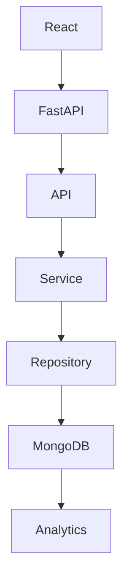

# Quiz Analytics Platform


Core philosophy:

> Store facts. Compute insights.

An analytics-focused Quiz Analytics Platform built to explore scalable backend architecture, event-driven learning analytics, and modern software engineering practices using React, FastAPI, and MongoDB.

---

## License

This project is intended for educational and portfolio purposes.

---

## Project Highlights

- Layered backend architecture (Repository + Service pattern)
- FastAPI REST APIs with OpenAPI/Swagger
- MongoDB Atlas integration
- Event-driven quiz analytics
- Learning Velocity Index
- Fatigue Score
- Difficulty Analysis
- Question Difficulty Index

---

## Table of Contents

- [Vision](#vision)
- [Getting Started](#getting-started)
- [Tech Stack](#tech-stack)
- [Project Structure](#project-structure)
- [Features](#features)
- [API Endpoints](#api-endpoints)
- [Analytics](#analytics)
- [Architecture Philosophy](#architecture-philosophy)
- [Roadmap](#roadmap)
- [Future Improvements](#future-improvements)
- [Author](#author)


## Vision

Rather than storing only quiz scores, this platform captures every quiz interaction as immutable events and derives meaningful learning insights using MongoDB aggregation pipelines.

---

## Getting Started

### Backend

```bash
cd backend
python -m venv venv
venv\Scripts\activate
pip install -r requirements.txt
uvicorn main:app --reload
```

---

## Tech Stack


| Layer           | Technology        |
| --------------- | ----------------- |
| Frontend        | React + Vite      |
| Backend         | FastAPI + Python  |
| Validation      | Pydantic          |
| Database        | MongoDB Atlas     |
| Documentation   | OpenAPI + Swagger |
| Version Control | Git + GitHub      |

Architecture

- Repository Pattern
- Service Layer
- Layered Architecture


---


## Project Structure

```text
quiz-analytics-platform/

├── backend/
│   ├── app/
│   │   ├── api/
│   │   ├── services/
│   │   ├── repositories/
│   │   ├── analytics/
│   │   ├── database/
│   │   └── config/
│
├── frontend/
│
├── docs/
│
├── seed/
│
└── diagrams/
```
---

## Why this project?

Most quiz applications store only the final score.

This platform captures every meaningful learning event, allowing richer analytics such as response time, learning velocity, fatigue detection, and topic mastery.

---

## Features

✅ Layered Backend Architecture

✅ FastAPI REST APIs

✅ MongoDB Atlas Integration

✅ Event-driven Quiz Tracking

✅ Swagger Documentation

✅ Learning Velocity Index

✅ Fatigue Detection

✅ Difficulty Analysis

✅ Question Difficulty Index

🚧 React Dashboard

🚧 Deployment

🚧 Adaptive Recommendations

---

## Engineering Progress

- [x] Repository Initialized
- [x] Project Architecture Designed
- [x] FastAPI Configured
- [x] Swagger Documentation
- [x] APIRouter Setup
- [x] MongoDB Connection
- [x] Repository Layer
- [x] Service Layer
- [x] Quiz Engine
- [x] Analytics Engine
- [ ] React Integration
- [ ] Deployment

---

## API Endpoints

### Quiz

POST /quiz/start

POST /quiz/{session_id}/answer

POST /quiz/{session_id}/finish

GET /quiz/{session_id}/analytics

```json
{
  "score": 50,
  "questionsAnswered": 5,
  "correctAnswers": 5,
  "accuracy": 100,
  "averageResponseTime": 23.2,
  "learningVelocityIndex": 88.4,
  "fatigueScore": 0,
  "difficultyAnalysis": {
    "Easy": {
      "attempted": 2,
      "correct": 2
    },
    "Medium": {
      "attempted": 2,
      "correct": 2
    },
    "Hard": {
      "attempted": 1,
      "correct": 1
    }
  }
}
```

GET /quiz/analytics/question-difficulty

```json
[
  {
    "questionId": 1,
    "attempts": 5,
    "accuracy": 60,
    "averageResponseTime": 14.4,
    "difficultyScore": 40
  }
]
```

### Questions

GET /questions

GET /questions/{question_id}

### Health

GET /

---

## Analytics

The backend derives analytics from stored quiz events instead of relying solely on final scores. Current metrics include:

- Quiz Accuracy
- Average Response Time
- Learning Velocity Index
- Fatigue Score
- Difficulty Analysis
- Question Difficulty Index

---

## Database Collections

- questions
- quiz_sessions

---

## Architecture Philosophy

This project follows a layered architecture.



Every layer owns exactly one responsibility.

---

## Design Principles

- Single Responsibility Principle
- Separation of Concerns
- Repository Pattern
- Service Layer Pattern
- Event-driven Analytics
- Configuration Management
- Clean Project Structure

---

## Status

✅ Backend complete

🚧 React dashboard and deployment are planned next.


## Roadmap

- ✅ Foundation
- ✅ Data Layer
- ✅ Quiz Engine
- ✅ Analytics Engine
- 🚧 React Dashboard
- 🚧 Deployment

## Future Improvements

- Adaptive quizzes
- AI-generated question recommendations
- Instructor Dashboard
- Team Analytics

## Project Philosophy

The platform stores quiz events rather than only quiz scores.

By preserving every interaction, analytics can evolve without changing historical data.

## Current Vertical Slice

The project has reached its first complete vertical slice:

Current Vertical Slice

```text
FastAPI
   ↓
Repository Layer
   ↓
Service Layer
   ↓
MongoDB Atlas
   ↓
Swagger Verification
```

## Example Workflow

```text
User Starts Quiz
      ↓
Questions Loaded
      ↓
Answers Submitted
      ↓
Events Stored
      ↓
Analytics Computed
      ↓
Insights Generated
```

## Engineering Decisions

| Decision             | Reason                      |
| -------------------- | --------------------------- |
| Repository Pattern   | Isolates persistence        |
| Service Layer        | Encapsulates business rules |
| Event Storage        | Enables richer analytics    |
| Layered Architecture | Improves maintainability    |


## What I wanted to learn

This project was built to deepen my understanding of:

- Layered backend architecture
- FastAPI
- MongoDB Atlas
- Event-driven system design
- Analytics-oriented data modeling

## Repository Principles

Every folder has one responsibility.

Every layer has one purpose.

Every commit tells a story.

Every feature solves a real problem.

Store Facts.

Compute Insights.

## Engineering Motto

Onwards.

Upwards.

One Beautiful Commit.

One Beautiful Feature.

## Design Goal

This project is intentionally being developed one complete vertical slice at a time.

Every completed feature is expected to include:

- Architecture
- Implementation
- Documentation
- Swagger verification
- Git history

## Author

Rahul Puri

- GitHub: <https://github.com/Rahul-PuriRepo>
- Repository: <https://github.com/Rahul-PuriRepo/quiz-analytics-platform>